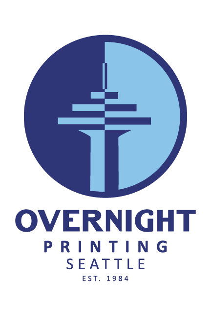

# Overnight Preflight Tool



A browser-based print preflight and Union Bug stamping tool for PDF and image artwork.

Overnight Preflight Tool helps production teams inspect incoming PDF files, apply selected corrections, add a configurable Union Bug, prepare bleed and crop settings, preview the result, and download a new production file. Processing takes place in the browser; the application does not require a backend service.

## Table of Contents

- [Features](#features)
- [Supported Files](#supported-files)
- [Quick Start](#quick-start)
- [How to Use the Application](#how-to-use-the-application)
- [PDF Preflight Checks](#pdf-preflight-checks)
- [Automatic Fixes and Tradeoffs](#automatic-fixes-and-tradeoffs)
- [Union Bug Settings](#union-bug-settings)
- [Bleed, Trim, Crop, and Safe Zone](#bleed-trim-crop-and-safe-zone)
- [Multi-Page PDFs](#multi-page-pdfs)
- [Output Files](#output-files)
- [Development Commands](#development-commands)
- [Project Structure](#project-structure)
- [How It Works](#how-it-works)
- [Limitations](#limitations)
- [Troubleshooting](#troubleshooting)
- [Deployment](#deployment)
- [Contributing](#contributing)

## Features

### PDF preflight

- Runs 11 print-oriented checks against uploaded PDFs.
- Reports pass, warning, and fixable error counts.
- Detects common issues involving bleed, image resolution, page size, fonts, colors, transparency, layers, overprint, blank pages, and PDF version.
- Re-scans the corrected PDF after an automatic fix is applied.
- Preserves the original upload in memory so the working file can be reset.

### Union Bug stamping

- Includes a default black Union Bug PDF.
- Supports replacement with a custom one-page PDF stamp.
- Keeps the Union Bug as vector artwork during standard PDF export.
- Provides left, center, and right quick alignment.
- Supports direct drag-and-drop positioning and proportional resizing on the canvas.
- Restricts the rendered Union Bug width to approximately `0.2"`–`2.0"`.
- Offers automatic black-or-white contrast, an extracted artwork palette, and a custom color picker.
- Stores independent stamp positions and sizes for individual PDF pages.

### Print geometry tools

- Displays CropBox, TrimBox, BleedBox, and MediaBox-derived geometry.
- Shows final canvas size, final trim size, bleed status, and active page.
- Adds a `0.125"` / `9 pt` mirrored bleed.
- Crops to the PDF TrimBox.
- Supports a uniform manual crop inset.
- Provides visual crop guides for each edge.
- Includes heuristic crop-mark auto-detection.
- Displays trim and `0.125"` safe-zone guides in the editor.

### Preview and export

- Supports multi-page PDF navigation and expandable page thumbnails.
- Provides zoom in, zoom out, and fit-to-screen controls.
- Includes light, dark, and system themes.
- Exports PDF artwork as PDF.
- Exports PNG/JPG artwork as PNG.
- Allows preflight/bleed-only processing without applying a Union Bug.

## Supported Files

| Purpose | Accepted input | Export format |
| --- | --- | --- |
| Artwork | PDF | PDF |
| Artwork | PNG, JPG, JPEG | PNG |
| Union Bug / stamp | PDF | Embedded in the final PDF or image |

Preflight analysis is available only for PDF artwork. Images can still use the visual editor, Union Bug, crop, bleed, and export tools.

## Quick Start

### Requirements

- Node.js 20 or newer is recommended.
- npm, included with Node.js.
- A modern browser with Canvas, File API, and Web Worker support.
- An internet connection when loading PDFs in development or production, because the PDF.js worker is loaded from jsDelivr.

### Install and run

```bash
git clone https://github.com/overnight-printing/preflight-checker.git
cd preflight-checker
npm install
npm run dev
```

Open the URL printed by Vite, normally:

```text
http://localhost:5173/
```

### macOS launcher

On macOS, `run.command` provides a convenience launcher. It checks for Node.js, installs dependencies when `node_modules` is missing, starts the Vite server, and opens the application in the default browser.

```bash
chmod +x run.command
./run.command
```

## How to Use the Application

### 1. Upload artwork

Upload or drag in a PDF, PNG, JPG, or JPEG file. The application renders the artwork locally in the browser.

For PDFs:

- The first page opens automatically.
- Page boxes and physical dimensions are displayed.
- Preflight analysis starts automatically.
- Multi-page navigation appears when applicable.

For images:

- The image is rendered as a single-page canvas.
- PDF-only preflight checks are unavailable.

### 2. Review the preflight report

Open the **Preflight** tab and review each result. A status can be:

- **Pass** — no issue was detected by the current check.
- **Warning** — review is recommended, but export is still available.
- **Error (Fixable)** — the application offers an automatic correction.

Use **Reset Artwork** at any time to return to the originally uploaded file.

### 3. Apply corrections carefully

Select an available fix for the issue you want to address. The application creates an updated in-memory PDF and runs the preflight scan again.

Some fixes preserve vector content, while others rasterize affected pages at 300 DPI. Review [Automatic Fixes and Tradeoffs](#automatic-fixes-and-tradeoffs) before using the output in production.

### 4. Configure the Union Bug

Open **Stamper Settings**, enable **Apply Union Bug**, and then:

1. Choose left, center, or right alignment.
2. Adjust the scale.
3. Select Auto Contrast, Palette, or Custom color.
4. Drag the stamp for exact placement if needed.
5. Resize it with the canvas handle if needed.
6. For a multi-page PDF, choose which pages should receive the stamp.

To use a different stamp, expand **Advanced Settings (Change Stamp PDF)** and upload a PDF.

### 5. Configure margins and crop

Use the margin tools as needed:

- **Add 0.125" Mirror Bleed** expands the output by 9 points on all sides and fills the new area with mirrored edge artwork.
- **Crop to Trim Box** uses the PDF TrimBox as the active page area.
- **Detect Crop Marks (Visual)** enables independent top, right, bottom, and left crop guides.
- **Auto-Detect** attempts to find crop marks from rendered pixels.
- **Manual Crop** applies a uniform inset in inches.
- **Safe Zone Guide** shows the trim boundary and a safe area 9 points inside it.

The guides are preview aids. Confirm the displayed final trim and canvas dimensions before exporting.

### 6. Create a customer proof or export production artwork

To prepare a review file, enter the estimate or invoice number and click **Create Customer Proof PDF**. The resulting PDF:

- uses that number as the Proof ID on every page;
- shows the complete bleed area with a labeled cut/TrimBox line;
- labels every artwork page and its finished dimensions;
- includes the company logo, approval instructions, and review-copy guidance.
- preserves original PDF artwork color spaces and applies lossless PDF object-stream compression.

The color-preserving proof does not rasterize or downsample PDF artwork. File-size savings therefore depend on how efficiently the source PDF was already encoded; image-heavy proofs may remain close to the original file size.

Customer proofs use a filename such as `campaign-flyer_Customer_Proof_EST-1042.pdf`.

Click **Save Production File** for production artwork.

- A stamped production file uses the suffix `_Production`.
- A file exported without the Union Bug uses the suffix `_Fixed`.
- PDF input downloads as PDF.
- Image input downloads as PNG.

## PDF Preflight Checks

| Check | What the tool evaluates | Result behavior |
| --- | --- | --- |
| Image Resolution | Estimates effective resolution of embedded raster images | Warns below 300 DPI |
| Bleed Margin | Compares TrimBox and BleedBox geometry | Errors when bleed is missing or below approximately 9 pt |
| Overprint | Searches graphics-state dictionaries for enabled overprint flags | Offers overprint removal |
| Font Embedding | Inspects referenced font descriptors for embedded font programs | Offers page rasterization |
| Color Mode | Looks for RGB color spaces in page resources and images | Warns when RGB content is detected |
| Page Size Match | Compares page dimensions with the first page | Warns when dimensions differ by more than 3 pt |
| Transparency | Inspects transparency groups, opacity, and blend modes | Warns when transparency is detected |
| Spot Colors | Looks for Separation and DeviceN color spaces | Offers page rasterization |
| Blank Pages | Flags pages with no extracted text and no XObject artwork | Offers page removal |
| Hidden Layers | Checks for optional-content configuration in the PDF catalog | Offers layer-structure removal |
| PDF Version | Reads the PDF header version | Warns below PDF 1.4 |

These checks are practical browser-side heuristics, not a replacement for a RIP, Acrobat Preflight, callas pdfToolbox, or a final press-operator review.

## Automatic Fixes and Tradeoffs

| Fix | Implementation | Important tradeoff |
| --- | --- | --- |
| Add Mirror Bleed | Creates a 9 pt mirrored extension around the artwork | Mirrored edges may be visible on artwork with text or distinct edge details |
| Remove Overprint | Disables `OP` and `op` graphics-state flags | Changes intentional overprint behavior as well as accidental overprint |
| Outline Fonts | Rasterizes affected pages at 300 DPI | The current implementation does not create vector outlines; text is no longer editable or searchable on rasterized pages |
| Convert Spot Colors | Rasterizes affected pages at 300 DPI | Output is flattened raster artwork, not a true color-managed CMYK conversion |
| Remove Blank Pages | Deletes pages identified by the blank-page heuristic | Visually sparse or structurally unusual pages should be reviewed before removal |
| Flatten Layers | Removes optional-content configuration | Complex layer behavior may not be reproduced exactly |

Always inspect the downloaded file in a production PDF viewer before sending it to print.

## Union Bug Settings

### Alignment

Quick Align places the stamp near the bottom safe area:

- **Align Left**
- **Align Center**
- **Align Right**

Dragging the stamp switches that page to a custom position.

### Size

The scale range is calculated from the uploaded stamp's original width so that the final stamp remains approximately between `0.2"` and `2.0"` wide. The current physical dimensions are shown next to the scale percentage.

### Color

- **Auto Contrast** samples the artwork behind the stamp and chooses black or white.
- **Palette** extracts dominant colors from the artwork and offers up to five choices.
- **Custom** accepts any browser color-picker value.

For standard PDF export without bleed or manual crop, the tool modifies supported black/grayscale vector color operators in the stamp PDF and embeds the result as vector artwork. Custom stamp PDFs with unusual color operators or complex structures may not tint completely.

## Bleed, Trim, Crop, and Safe Zone

All PDF dimensions use PDF points internally:

```text
72 pt = 1 inch
9 pt = 0.125 inch
```

### Guide colors

- Blue or magenta solid line: trim/cut boundary.
- Cyan dashed line: safe zone, 9 pt inside the trim boundary.
- Orange line with shaded exterior: active visual crop area.

### Processing paths

When no bleed or manual/visual crop is active, the application can preserve the original PDF pages and add the Union Bug as a vector overlay.

When mirror bleed or manual/visual cropping is active, pages are rendered through the expanded-output path. This can flatten page artwork. Use the resulting file only after visual quality review.

## Multi-Page PDFs

Use the bottom navigation bar to move between pages. Expand the thumbnail strip for visual page selection.

Union Bug application options:

- Current Page Only
- All Pages
- Last Page Only
- First Page Only

Each visited page can retain its own stamp position and size. Before export, review every page that will receive the stamp, especially when pages have different dimensions or orientations.

Crop and bleed settings are global. Visual crop-guide values are currently shared across pages rather than stored independently.

## Output Files

Examples:

```text
campaign-flyer.pdf  -> campaign-flyer_Customer_Proof_EST-1042.pdf
campaign-flyer.pdf  -> campaign-flyer_Production.pdf
campaign-flyer.pdf  -> campaign-flyer_Fixed.pdf
postcard.jpg        -> postcard_Production.png
```

`_Customer_Proof_...` is the customer review packet. `_Production` means the Union Bug was enabled during production export. `_Fixed` means it was disabled; the file may still contain applied preflight, crop, or bleed changes.

Files are generated in the browser and downloaded through the browser's normal download mechanism.

## Development Commands

```bash
# Start the development server with hot module replacement
npm run dev

# Create a production build in dist/
npm run build

# Preview the production build locally
npm run preview

# Run ESLint
npm run lint
```

There is currently no automated test script in `package.json`.

## Project Structure

```text
preflight-checker/
├── public/
│   ├── union-bug-black.pdf
│   ├── union-bug-white.pdf
│   └── logo and favicon assets
├── src/
│   ├── components/
│   │   ├── ControlPanel.jsx
│   │   ├── EditorCanvas.jsx
│   │   ├── PageSelector.jsx
│   │   ├── PreflightPanel.jsx
│   │   └── UploadZone.jsx
│   ├── utils/
│   │   ├── colorAnalyzer.js
│   │   ├── pdfProcessor.js
│   │   ├── preflightChecker.js
│   │   └── textDetector.js
│   ├── App.jsx
│   ├── App.css
│   ├── index.css
│   └── main.jsx
├── index.html
├── package.json
├── run.command
└── vite.config.js
```

## How It Works

- **React** manages the editor and application state.
- **Vite** provides development and production builds.
- **PDF.js (`pdfjs-dist`)** loads and renders PDF pages for preview and analysis.
- **pdf-lib** reads PDF objects, updates graphics states and page structure, embeds the Union Bug, and writes output PDFs.
- **Canvas APIs** power image rendering, luminance sampling, palette extraction, crop detection, mirror bleed, and image export.
- **Lucide React** supplies interface icons.

The application has no database or server-side upload endpoint. Uploaded file data remains in the active browser session unless a separately deployed host modifies the application.

## Limitations

- PDF preflight results are heuristic and may produce false positives or false negatives.
- The PDF.js worker is loaded from a third-party CDN; offline PDF loading will fail unless the worker is bundled locally.
- Large or complex PDFs can consume significant browser memory and take longer to render.
- Encrypted or malformed PDFs may fail to load.
- Image DPI cannot be inferred reliably without complete physical-size metadata.
- Automatic crop-mark detection depends on rendered pixel patterns and may require manual adjustment.
- Crop, bleed, font, and color fixes can rasterize or flatten artwork.
- The “Outline Fonts” action is rasterization, not true vector font outlining.
- RGB and spot-color detection is not a complete ICC/color-management workflow.
- The tool does not provide PDF/X validation or output-intent verification.
- Browser rendering can differ from a commercial RIP.

## Troubleshooting

### The application does not start

Verify Node.js and npm:

```bash
node --version
npm --version
```

Then reinstall dependencies:

```bash
npm install
npm run dev
```

### A PDF stays blank or fails to load

- Confirm that the browser can reach jsDelivr.
- Try a current version of Chrome, Edge, Firefox, or Safari.
- Check whether the PDF is encrypted, damaged, or unusually large.
- Open the browser developer console for the underlying PDF.js error.

### The exported PDF looks flattened

Mirror bleed, manual crop, visual crop, and some automatic fixes use rasterization. Disable those options when vector preservation is more important, or perform the equivalent correction in professional prepress software.

### The Union Bug color does not change completely

The vector tinting routine targets common black RGB, grayscale, and CMYK operators. Use a simple one-page vector PDF with solid black artwork for the most reliable custom stamp recoloring.

### Auto-detect cannot find crop marks

Enable visual crop mode and adjust the top, right, bottom, and left guides manually. Verify the final physical dimensions in the geometry panel.

### The production build reports a large chunk warning

PDF.js and PDF editing libraries add substantial bundle size. The warning does not prevent a successful build. Future optimization can lazy-load PDF-specific modules or configure code splitting.

## Deployment

Create a production build:

```bash
npm ci
npm run build
```

Deploy the generated `dist/` directory to a static host.

`vite.config.js` automatically uses `/overnight-preflight-tool/` as the base path when the `GITHUB_ACTIONS` environment variable is present. If the GitHub Pages repository path differs, update the configured base path before deployment.

Because this is a client-side application, the host only needs to serve static files. Ensure the deployment's Content Security Policy permits the PDF.js worker request to jsDelivr, or bundle the worker locally.

## Contributing

1. Create a branch for the change.
2. Make focused updates.
3. Run lint and build checks.
4. Manually test PDF upload, preflight, stamping, and export.
5. Open a pull request describing behavior changes and any effect on output fidelity.

```bash
npm run lint
npm run build
```

No license file is currently included in this repository. Contact the repository owner before redistributing or reusing the project outside its intended scope.
