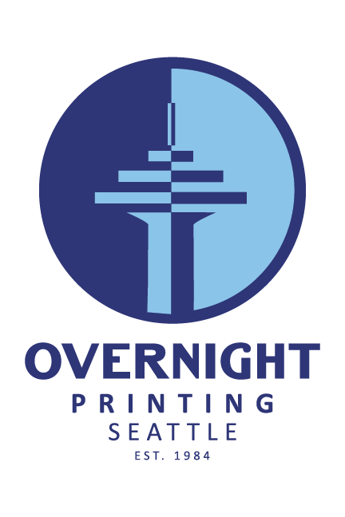

# Overnight Preflight Tool



A browser-based print preflight and Union Bug stamping tool for PDF and image artwork.

Overnight Preflight Tool helps production teams inspect incoming PDF files, apply selected corrections, add a configurable Union Bug, prepare bleed and crop settings, preview the result, and download a new production file. Processing takes place in the browser; the application does not require a backend service.

## Table of Contents

- [Features](#features)
- [Supported Files](#supported-files)
- [Quick Start](#quick-start)
- [How to Use the Application](#how-to-use-the-application)
- [PDF Preflight Checks](#pdf-preflight-checks)
- [Automatic Fixes and Tradeoffs](#automatic-fixes-and-tradeoffs)
- [Union Bug Settings](#union-bug-settings)
- [Bleed, Trim, Crop, and Safe Zone](#bleed-trim-crop-and-safe-zone)
- [Multi-Page PDFs](#multi-page-pdfs)
- [Output Files](#output-files)
- [Development Commands](#development-commands)
- [Project Structure](#project-structure)
- [How It Works](#how-it-works)
- [Limitations](#limitations)
- [Troubleshooting](#troubleshooting)
- [Deployment](#deployment)
- [Contributing](#contributing)

## Features

### PDF preflight

- Runs 18 print-oriented checks on source PDFs or prepared production output, with pass, review, error, and information counts.
- Explains the source-file findings and which corrections are available.
- Detects common issues involving bleed, image resolution, page size, fonts, colors, transparency, layers, overprint, blank pages, and PDF version.
- Re-scans the corrected PDF after an automatic fix is applied.
- Preserves the original upload in memory so the working file can be reset.

### Union Bug stamping

- Includes a default black Union Bug PDF.
- Supports replacement with a custom one-page PDF stamp.
- Keeps the Union Bug as vector artwork during standard PDF export.
- Provides independent horizontal and vertical alignment and keyboard movement/resizing.
- Supports direct drag-and-drop positioning and proportional resizing on the canvas.
- Restricts the rendered Union Bug width to approximately `0.2"`–`2.0"`.
- Offers automatic black-or-white contrast, an extracted artwork palette, and a custom color picker.
- Stores independent stamp positions and sizes for individual PDF pages.

### Print geometry tools

- Displays CropBox, TrimBox, BleedBox, and MediaBox-derived geometry.
- Shows final canvas size, final trim size, bleed status, and active page.
- Adds configurable mirror bleed, defaulting to `0.125"` / `9 pt`, outside the current artwork.
- Crops to the PDF TrimBox.
- Supports a uniform manual crop inset.
- Rejects crop insets that remove the page and preserves vector PDF resources during crop and bleed.
- Displays trim and `0.125"` safe-zone guides in the editor.

### Preview and export

- Supports multi-page PDF navigation and expandable page thumbnails.
- Provides zoom in, zoom out, and fit-to-screen controls.
- Includes light, dark, and system themes.
- Exports PDF artwork as PDF.
- Exports PNG/JPG artwork as PNG.
- Allows preflight/bleed-only processing without applying a Union Bug.
- Offers an explicit 300/600 DPI compatibility PDF for artwork that disappears on a printer: opaque RGB page images, followed by vector Union Bug stamping.

## Supported Files

| Purpose | Accepted input | Export format |
| --- | --- | --- |
| Artwork | PDF | PDF |
| Artwork | PNG, JPG, JPEG | PNG |
| Union Bug / stamp | PDF | Embedded in the final PDF or image |

Preflight analysis is available only for PDF artwork. Images can still use the visual editor, Union Bug, crop, bleed, and export tools.

## Quick Start

### Requirements

- Node.js 22.13 or newer (Node.js 24 recommended).
- npm, included with Node.js.
- A modern browser with Canvas, File API, and Web Worker support.
- The PDF.js worker and its WASM/JS decoder assets are bundled with the app; PDF processing requires no CDN connection once app assets are loaded. Missing decoder assets can hide CCITT/JBIG2 logos, JPEG 2000 images, or gradient artwork, so deployment must include the entire generated assets folder.

### Install and run

```bash
git clone https://github.com/overnight-printing/preflight-checker.git
cd preflight-checker
npm install
npm run dev
```

Open the URL printed by Vite, normally:

```text
http://localhost:5173/
```

### macOS launcher

On macOS, `run.command` provides a convenience launcher. It checks for Node.js, installs dependencies when `node_modules` is missing, starts the Vite server, and opens the application in the default browser.

```bash
chmod +x run.command
./run.command
```

## How to Use the Application

### 1. Upload artwork

Upload or drag in a PDF, PNG, JPG, or JPEG file. The application renders the artwork locally in the browser.

For PDFs:

- The first page opens automatically.
- Page boxes and physical dimensions are displayed.
- Open **Preflight** and click **Analyze PDF** to run the full scan.
- Multi-page navigation appears when applicable.

For images:

- The image is rendered as a single-page canvas.
- PDF-only preflight checks are unavailable.

### 2. Review the preflight report

Open the **Preflight** tab and review each result. A status can be:

- **Pass** — no issue was detected by the current check.
- **Warning** — review is recommended, but export is still available.
- **Error** — repair before printing; source-app repairs are required for some errors.
- **Info** — a valid or declared feature is present; this is not an automatic defect.

Use **Reset Artwork** at any time to return to the originally uploaded file.

### 3. Apply corrections carefully

Select an available repair for the issue you want to address. **Remove Overprint**, **Remove First Blank Page**, and **Apply flattening repair (RGB)** create an updated in-memory PDF and rerun the scan. **Add Mirror Bleed** schedules the job's required bleed for export; use **Check production output** to verify it. **Save Production File** downloads the repaired PDF. Your original upload remains available through **Reset Artwork**.

Bleed, overprint and blank-page repairs preserve PDF resources. When findings include transparency, gradients, masks or optional layers, **Repair disappearing artwork** offers an explicit 300/600 DPI RGB repair. It bakes the saved visible artwork, updates the preview and removes those live effects from the working PDF. It also converts source vectors/text and press ink plates to pixels, so review its tradeoffs before applying. Missing fonts, low-resolution originals and unwanted spot inks need correction in the source application. The separate **PDF output → Flatten visible artwork (RGB)** option applies the same appearance fallback only when preparing output.

### 4. Configure the Union Bug

Open **Stamper Settings**, enable **Apply Union Bug**, and then:

1. Choose horizontal and vertical alignment with the Align to page controls.
2. Adjust the scale.
3. Select Auto Contrast, Palette, or Custom color.
4. Drag the stamp or focus it and use arrow keys for exact placement (Shift moves in larger steps).
5. Resize it with the canvas handle or focus the handle and use arrow keys.
6. For a multi-page PDF, choose which pages should receive the stamp. Move between pages with the page bar and place the stamp separately on each page.

To use a different stamp, expand **Advanced Settings (Change Stamp PDF)** and upload a PDF.

### 5. Configure margins and crop

Use the margin tools as needed:

- **Add 0.125" Mirror Bleed** expands the output by 9 points on all sides and fills the new area with mirrored edge artwork.
- **Crop to Trim Box** uses the PDF TrimBox as the active page area.
- **Manual inset**, available under crop settings, applies a uniform inset in inches. Image print dimensions use the chosen **Image resolution** (300 DPI by default).
- **Safe Zone Guide** shows the trim boundary and a safe area 9 points inside it.

The guides are preview aids. Confirm the displayed final trim and canvas dimensions before exporting.

### 6. Create a customer proof or export production artwork

To prepare a review file, enter the estimate or invoice number and click **Create Customer Proof PDF**. The resulting PDF:

- uses that number as the Proof ID on every page;
- shows the complete bleed area with a labeled cut/TrimBox line;
- labels every artwork page and its finished dimensions;
- includes the company logo, approval instructions, and review-copy guidance.
- preserves original PDF artwork color spaces and applies lossless PDF object-stream compression.

With **Preserve vectors and source colors**, the proof does not rasterize or downsample PDF artwork. File-size savings therefore depend on how efficiently the source PDF was already encoded; image-heavy proofs may remain close to the original file size. Selecting compatibility output also flattens the artwork used in the customer proof.

Customer proofs use a filename such as `campaign-flyer_Customer_Proof_EST-1042.pdf`.

Click **Save Production File** for production artwork.

- A stamped production file uses the suffix `_Proof`.
- A file exported without the Union Bug uses the suffix `_Fixed`.
- PDF input downloads as PDF.
- Image input downloads as PNG.

## PDF Preflight Checks

| Check | What the tool evaluates | Result behavior |
| --- | --- | --- |
| Image Resolution | Estimates effective resolution of embedded raster images | Warns below the selected job DPI target (default 300) |
| Bleed Margin | Compares TrimBox and BleedBox geometry | Compares each edge against the selected job target (default 9 pt); no-bleed jobs are supported |
| Overprint | Searches graphics-state dictionaries for enabled overprint flags | Offers overprint removal |
| Font Embedding | Inspects referenced font descriptors for embedded font programs | Requires embedding or outlining in the source application |
| Color Mode | Looks for RGB color spaces in page resources and images | Warns when RGB content is detected |
| Page Size Match | Compares page dimensions with the first page | Warns when dimensions differ by more than 3 pt |
| Transparency | Inspects transparency groups, opacity, and blend modes | Informational for general/PDF/X-4 workflows; an error for legacy PDF/X-1a |
| Gradients & Shadings | Finds PDF shading dictionaries, including nested artwork | Explains printer/RIP rendering risks without treating valid gradients as defects |
| Image Masks | Finds stencil and explicit image masks | Identifies opaque masked artwork, including white logos; offers compatibility export guidance for printer failures |
| Spot Colors | Looks for Separation and DeviceN color spaces | Lists intended ink plates; requires color-managed source conversion for unwanted spots |
| Blank Pages | Checks PDF.js painting operators, including paths and outlined artwork | Offers removal of the first flagged page while retaining at least one page |
| Hidden Layers | Checks for optional-content configuration in the PDF catalog | Requests visibility review; removing the catalog alone is unsafe |
| PDF Version | Reads the PDF header version | Checks the selected workflow; PDF/X-4 requires 1.6 or later |

| Finished Trim & Page Boxes | Checks explicit TrimBoxes and containment of page boundaries | Flags missing trim and invalid boxes |
| Press Output Profile | Reads embedded ICC output-intent headers and channel counts | Reports missing/unreadable profiles; asks for press/paper confirmation |
| PDF/X Declaration | Reads source PDF/X metadata | Reports declarations without claiming full conformance |
| Annotations & Forms | Checks for annotations and interactive form fields | Requests review/flattening of intended printable appearances |
| Physical Page Units | Detects custom UserUnit scaling | Requests physical-dimension review for unusual PDFs |

### Job requirements and production checks

The default is **General commercial printing**, with editable targets of **300 DPI** and **0.125-inch bleed**. Open **Job requirements** to choose the actual resolution, required bleed (including none), or a PDF/X-4 / legacy PDF/X-1a job. Bleed and DPI are job-specific targets, not universal PDF/X requirements. Live transparency, spot inks, and optional layers can be intentional. Black overprint is not automatically an error, and blank pages can be intentional for binding or imposition.

**Analyze PDF** evaluates the current source. **Check production output** first prepares the exact crop/bleed/stamp path, then analyzes that output. Production results are invalidated when those settings change. **Download preflight report** saves the checked scope, requirements, and results as JSON. A production check does not flatten source annotations or form-field appearances; review the source warnings before geometry changes or proofing. Production reports retain that warning when rebuilt output omits source annotations/forms.

Output ICC intents, saved layer configurations and references, and page transparency blending groups are retained during resource-preserving export and customer proofing. Default black/white stamps use DeviceGray, avoiding an unnecessary RGB black. Stamps use isolated, opaque knockout settings, so inherited source overprint, masks, blend modes, or opacity cannot hide them.

PDF/X requires self-contained fonts and defined output conditions; minimum DPI and bleed depend on the job. See the [PDF Association PDF/X requirements](https://pdfa.org/pdfx-the-key-facts/) and [Ghent Workgroup commercial print guidance](https://gwg.org/commercial-print/). Selecting a PDF/X workflow here does not convert or certify a PDF/X file.

These checks are practical browser-side heuristics, not a replacement for a RIP, Acrobat Preflight, callas pdfToolbox, or a final press-operator review.

## Automatic Fixes and Tradeoffs

| Fix | Implementation | Important tradeoff |
| --- | --- | --- |
| Add Mirror Bleed | Schedules a mirrored extension matching the job's bleed requirement, retaining any larger configured extension | Mirrored edges may be visible on artwork with text or distinct edge details; verify production output before saving |
| Remove Overprint | Disables `OP` and `op` graphics-state flags | Changes intentional overprint behavior as well as accidental overprint |
| Remove Blank Pages | Deletes pages identified by the blank-page heuristic | Visually sparse or structurally unusual pages should be reviewed before removal |
| Optional content layers | Normal output retains saved visibility configuration | Explicit compatibility output bakes saved display visibility; print visibility may differ |
| Flatten visible artwork (RGB) | Renders each source page on white at the selected 300 or 600 DPI, before crop/bleed/vector stamping | Source text, vectors, CMYK and spot plates become RGB pixels; source output profiles are removed; annotations/forms are excluded; PDF.js does not simulate overprint |
| Apply flattening repair (RGB) | Uses the same flattening engine to replace the working PDF and rerun preflight immediately | Same RGB tradeoffs; reports and filenames retain the repair mode/resolution, and omitted annotations/forms remain a warning after rescanning |

Always inspect the downloaded file in a production PDF viewer before sending it to print.

### Printer compatibility output

Use **PDF output → Flatten visible artwork (RGB)** when objects, masked logos, or gradients look correct in the preview but disappear on a printer. Choose **600 DPI** for fine artwork and text, or **300 DPI** for smaller files, then **Check production output** and **Save Production File**. The filename includes `_Compatibility_600dpi` or `_Compatibility_300dpi`; the production report records the mode and resolution. New uploads return to vector/color-preserving output.

This operation bakes the source artwork into one opaque RGB page image. The original upload stays available, page boxes and rotation are retained, and added Union Bugs remain vector. Existing low-resolution artwork does not gain detail. Browser memory limits are 40 million pixels per page, 120 million pixels per document, and 16,384 pixels per canvas edge; the tool rejects oversized jobs and never silently lowers the selected DPI.

This is not selective transparency flattening, CMYK conversion, PDF/X conversion, or press proofing. Use a color-managed desktop flattener with the printer's output profile when source separations, vector text, or exact press colors must be retained. Check saved layer visibility and source annotations/forms before export, and print a test page.

## Union Bug Settings

### Alignment

**Align to page** offers horizontal left, center, or right alignment and vertical top, middle, or bottom alignment within the safe area. Each control preserves the position on the other axis.

Dragging the stamp switches that page to a custom position.

### Size

The scale range is calculated from the uploaded stamp's original width so that the final stamp remains approximately between `0.2"` and `2.0"` wide. The current physical dimensions are shown next to the scale percentage.

### Color

- **Auto Contrast** samples the artwork behind the stamp and chooses black or white.
- **Palette** extracts dominant colors from the artwork and offers up to five choices.
- **Custom** accepts any browser color-picker value.

For PDF export, including bleed and manual crop, the tool modifies supported black/grayscale vector color operators in the stamp PDF and embeds the result as vector artwork. Custom stamp PDFs with unusual color operators or complex structures may not tint completely.

## Bleed, Trim, Crop, and Safe Zone

All PDF dimensions use PDF points internally:

```text
72 pt = 1 inch
9 pt = 0.125 inch
```

### Guide colors

- Blue or magenta solid line: trim/cut boundary.
- Cyan dashed line: safe zone, 9 pt inside the trim boundary.

### Processing paths

When no bleed or manual/visual crop is active, the application can preserve the original PDF pages and add the Union Bug as a vector overlay.

In normal output, mirror bleed, TrimBox cropping, and manual insets embed and clip the original PDF resources, preserving vectors and source color spaces. Explicit compatibility output first rasterizes the visible source artwork; the same geometry and vector stamping operations then apply.

## Multi-Page PDFs

Use the bottom navigation bar to move between pages. Expand the thumbnail strip for visual page selection.

Union Bug application options:

- Current Page Only
- All Pages
- Last Page Only
- First Page Only
- Even or Odd Pages
- Custom Pages and Ranges (for example `2, 4, 7-10`)

Each visited page retains its own stamp position and size. Export calculates alignment and automatic contrast for each selected page, including pages with different sizes or rotations. The preview shows the stamp only on selected pages.

Crop and bleed settings apply to every page. Invalid page selections and destructive crop settings block export with an explanation.

## Output Files

Examples:

```text
campaign-flyer.pdf  -> campaign-flyer_Customer_Proof_EST-1042.pdf
campaign-flyer.pdf  -> campaign-flyer_Proof.pdf
campaign-flyer.pdf  -> campaign-flyer_Fixed.pdf
postcard.jpg        -> postcard_Proof.png
```

`_Customer_Proof_...` is the customer review packet. `_Proof` means the Union Bug was enabled during production export. `_Fixed` means it was disabled; the file may still contain applied preflight, crop, or bleed changes.

Files are generated in the browser and downloaded through the browser's normal download mechanism.

## Development Commands

```bash
# Start the development server with hot module replacement
npm run dev

# Create a production build in dist/
npm run build

# Preview the production build locally
npm run preview

# Run ESLint
npm run lint
```

Run `npm test` for the unit regression suite. See **Verification** below for the browser and PDF checks.

## Project Structure

```text
preflight-checker/
├── public/
│   ├── union-bug-black.pdf
│   ├── union-bug-white.pdf
│   └── logo and favicon assets
├── src/
│   ├── components/
│   │   ├── ControlPanel.jsx
│   │   ├── EditorCanvas.jsx
│   │   ├── PageSelector.jsx
│   │   ├── PreflightPanel.jsx
│   │   └── UploadZone.jsx
│   ├── utils/
│   │   ├── colorAnalyzer.js
│   │   ├── pdfProcessor.js
│   │   ├── preflightChecker.js
│   │   └── textDetector.js
│   ├── App.jsx
│   ├── App.css
│   ├── index.css
│   └── main.jsx
├── index.html
├── package.json
├── run.command
└── vite.config.js
```

## How It Works

- **React** manages the editor and application state.
- **Vite** provides development and production builds.
- **PDF.js (`pdfjs-dist`)** loads and renders PDF pages for preview and analysis.
- **pdf-lib** reads PDF objects, updates graphics states and page structure, embeds the Union Bug, and writes output PDFs.
- **Canvas APIs** power image rendering, luminance sampling, palette extraction, crop detection, mirror bleed, and image export.
- **Lucide React** supplies interface icons.

The application has no database or server-side upload endpoint. Uploaded file data remains in the active browser session unless a separately deployed host modifies the application.

## Limitations

- PDF preflight results are heuristic and may produce false positives or false negatives.
- PDF.js and PDF editing engines load on demand. A first visit still needs access to the hosted app assets; there is no offline app cache.
- Large or complex PDFs can consume significant browser memory and take longer to render.
- Encrypted or malformed PDFs may fail to load.
- Image DPI cannot be inferred reliably without complete physical-size metadata.
- Automatic crop-mark detection depends on rendered pixel patterns and may require manual adjustment.
- Missing fonts and unwanted spot inks must be repaired in the source application. Crop, bleed, and stamping preserve PDF resources.
- There is no vector font outlining or color-managed CMYK conversion. Those require source fonts and the printer’s output profile.
- RGB and spot-color detection is not a complete ICC/color-management workflow.
- PDF/X declarations and ICC output-intent headers are inspected, but full PDF/X conformance, ICC profile validity, font glyph coverage, white-overprint object analysis, separations, total ink coverage, and press rendering require a dedicated prepress engine.
- Browser rendering can differ from a commercial RIP.

## Troubleshooting

### The application does not start

Verify Node.js and npm:

```bash
node --version
npm --version
```

Then reinstall dependencies:

```bash
npm install
npm run dev
```

### A PDF stays blank or fails to load

- Confirm that the browser can load the bundled worker asset from your host.
- Try a current version of Chrome, Edge, Firefox, or Safari.
- Check whether the PDF is encrypted, damaged, or unusually large.
- Open the browser developer console for the underlying PDF.js error.

### The exported PDF looks flattened

Check **PDF output**. **Preserve vectors and source colors** retains original PDF resources; **Flatten visible artwork (RGB)** deliberately produces page images. Use **Reset Artwork** if an older session or externally modified PDF was rasterized.

### Objects, white logos, or gradients disappear on the printer

- Inspect the source in Acrobat Output Preview with overprint simulation. White objects should normally knock out, not overprint. Do not remove all overprint blindly; black text and intentional ink combinations may depend on it.
- A white logo may be a stencil/image mask even in an already flattened PDF/X-1a file. Flattening live transparency alone may leave that stencil unchanged.
- Test one page using Acrobat **Print → Advanced → Print as Image** at 600 DPI. [Adobe's instructions](https://helpx.adobe.com/ca/acrobat/kb/quick-fix-print-pdf-image.html) explain how this bypasses printer PDF interpretation.
- For a downloadable fallback, select **Flatten visible artwork (RGB)** in this tool. Confirm the visible artwork and printer color settings before printing.
- For commercial CMYK/spot production, use a desktop transparency flattener and the shop's output profile; retain vectors where possible. [Adobe's flattener documentation](https://helpx.adobe.com/acrobat/using/transparency-flattening-acrobat-pro.html) describes the controls and tradeoffs.

### The Union Bug color does not change completely

The vector tinting routine targets common black RGB, grayscale, and CMYK operators. Use a simple one-page vector PDF with solid black artwork for the most reliable custom stamp recoloring.

### The file contains crop marks

Visual crop-mark detection is not currently available. Use the explicit TrimBox and manual inset, then verify output dimensions.

### The production build reports a large chunk warning

PDF.js and PDF editing libraries add substantial bundle size. The warning does not prevent a successful build. PDF engines are loaded on demand and split into separate chunks.

## Deployment

Create a production build:

```bash
npm ci
npm run build
```

Deploy the generated `dist/` directory to a static host.

`vite.config.js` automatically uses `/overnight-preflight-tool/` as the base path when the `GITHUB_ACTIONS` environment variable is present. If the GitHub Pages repository path differs, update the configured base path before deployment.

Because this is a client-side application, the host only needs to serve static files. Ensure the host serves the bundled `.mjs` worker with a JavaScript content type and allows workers from the same origin.

## Contributing

1. Create a branch for the change.
2. Make focused updates.
3. Run lint and build checks.
4. Manually test PDF upload, preflight, stamping, and export.
5. Open a pull request describing behavior changes and any effect on output fidelity.

```bash
npm run lint
npm run build
```

No license file is currently included in this repository. Contact the repository owner before redistributing or reusing the project outside its intended scope.

## Verification

Run unit tests, lint, and the production build:

```bash
npm test
npm run lint
npm run build
```

The browser regression script creates its own fixtures and downloads real app exports. It needs a running development server, Chrome, and Playwright (installed separately from application dependencies):

```bash
npm install --prefix /tmp/preflight-browser playwright
PLAYWRIGHT_MODULE=/tmp/preflight-browser/node_modules/playwright node scripts/verify-browser.cjs
python3 scripts/verify-pdf.py
PLAYWRIGHT_MODULE=/tmp/preflight-browser/node_modules/playwright node scripts/verify-compatibility.cjs
```

Outputs, screenshots, and Poppler inspection files are saved under `output/audit/` (ignored by Git). Set `PREFLIGHT_BASE_URL` to change the development-server URL or `PREFLIGHT_AUDIT_OUTPUT` to change the output folder. The PDF verification script requires `pdfinfo`, `pdfimages`, and `pdftoppm`. Visually inspect the rendered PDFs after the automated checks.

The compatibility regression checks gradients, nested transparency/soft masks, saved hidden-layer visibility, page boxes/rotation, multiple pages, requested image resolution, opaque RGB resources, vector stamping, production reports, and reset on upload. It also exercises direct preflight flattening, automatic rescanning, restore-original behavior, persistent annotation omission warnings and 5 mm job bleed repair. Its intentional page images are checked separately from the normal export's zero-raster-resource fixtures.

To verify decoder loading under the deployment base path, build with `GITHUB_ACTIONS=true`, start `GITHUB_ACTIONS=true npm run preview`, and set `PREFLIGHT_PRODUCTION_URL` to the preview URL when running `verify-compatibility.cjs`. Its UI checks then use the production build while utility checks still use the development server, and assert that the white CCITT stencil decoder loads successfully from the generated assets.
